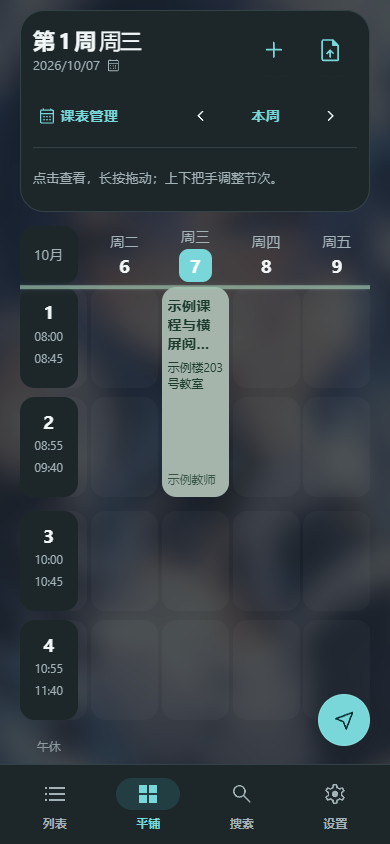
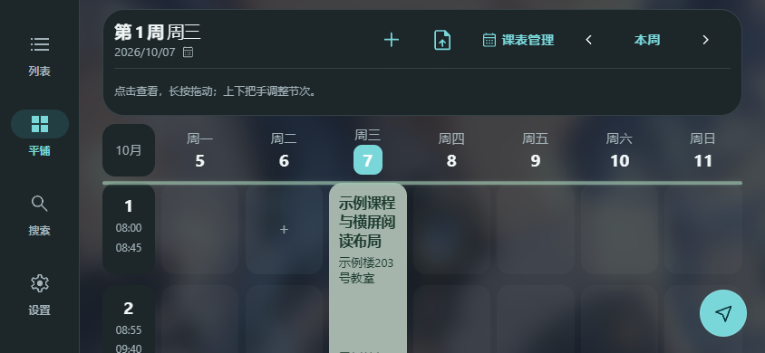
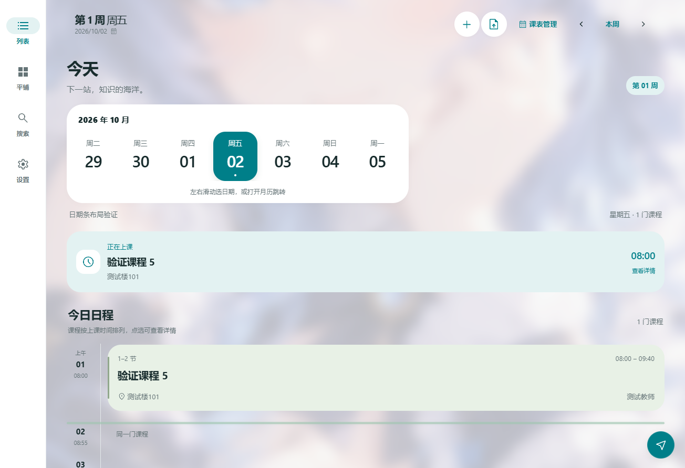
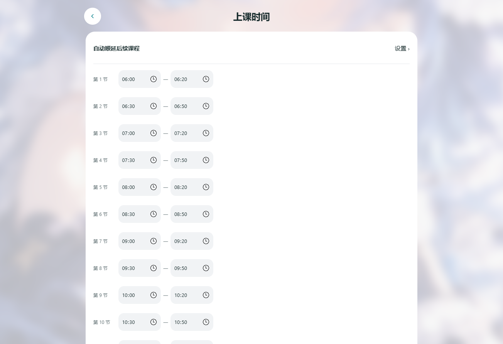
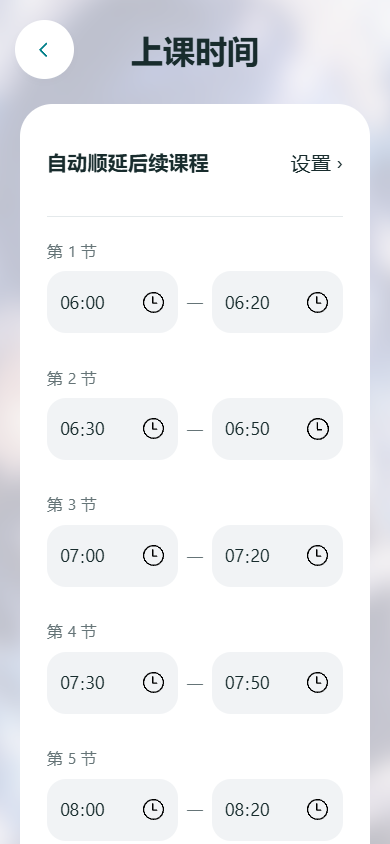
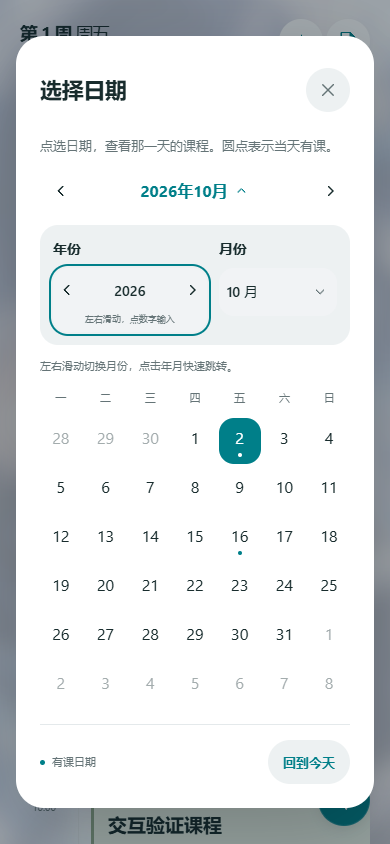
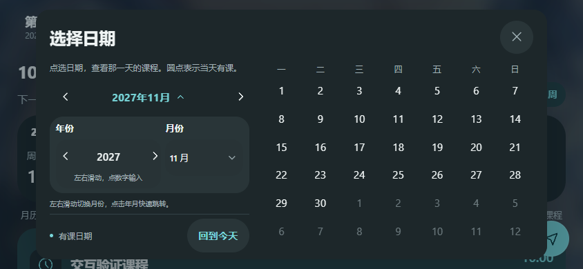
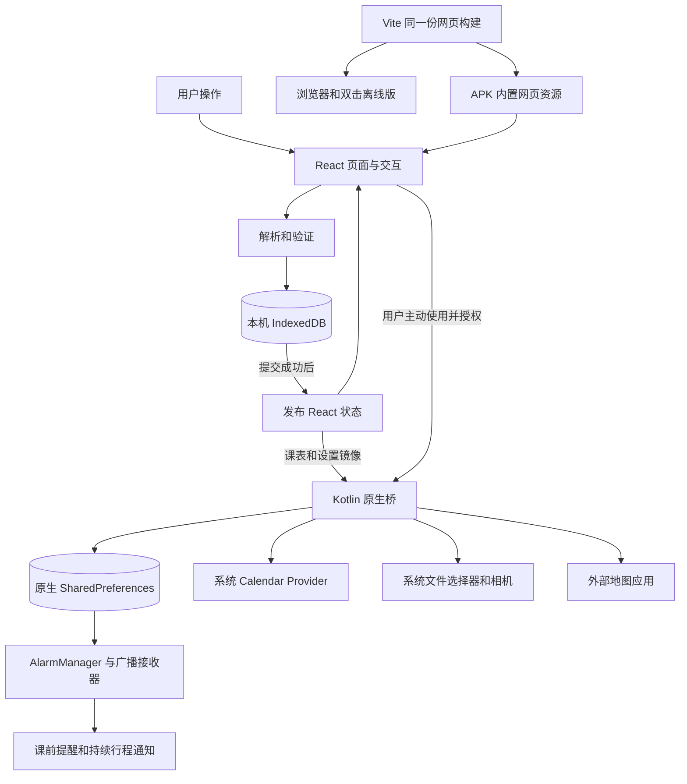

<p align="center">
  
</p>

# Dolphin Calendar

**把课程、教材和上课提醒放在一起。**

Dolphin Calendar 是面向校园日常的本地课表应用。它用同一套 React 界面提供网页版和 Android 安装版：主页看课程，点击课程看教师、教室和教材，需要时再开启提醒、导航或系统日历。

无需账号，没有自建业务服务器，也不自动上传课表、封面或背景。Android 的基础课表界面和资源均随 APK 内置；地图导航使用用户选择的外部地图应用。本文对应 **1.4.7 源码**，各版本的构建与设备验证结果见 [验证与使用说明](docs/STATUS.md)。源码仓库：[tequed232/Dolphin-Calendar](https://github.com/tequed232/Dolphin-Calendar)。

在线使用：[Dolphin Calendar 网页版](https://tequed232.github.io/Dolphin-Calendar/)。网页版发布运行 `npm run build:pages`，入口为 `build/pages/index.html`。该入口内置编译后的界面代码和样式，图片与离线缓存文件随整个目录发布，支持 `/Dolphin-Calendar/` 子路径。不要将开发用的 `web/index.html` 单独上传。发布工作流和 Pages 发布条件见 [发布说明](docs/PUBLISHING.md)。

[功能](#功能概览) · [JSON 格式](#json-课表格式) · [本地开发](#本地开发) · [架构](#工程架构) · [验证](#验证与测试) · [许可](#许可证与美术资产)

<p align="center">
  
  
</p>

*截图为 1.4.5 网页界面的实际验证画面，课程、教师和地点均为演示数据。Android 使用 WebView 外的原生导航，竖屏置底、横屏和宽屏置于侧边。界面支持浅色、深色与跟随系统。*

## 1.4.7 日期与时间布局完善

宽屏日期条限制在合适宽度，避免日期间隙过大；上课时间为节次标签保留完整空间，两个时间输入更紧凑，并适应手机、横屏及较大字体。应用实现只改对应 CSS，日期选择、时间输入与保存、自动顺延和导入业务继续沿用。

<p align="center">
  <a href="docs/UI_1.4.7.md"></a>
</p>
<p align="center">
  <a href="docs/UI_1.4.7.md"></a>
  <a href="docs/UI_1.4.7.md"></a>
</p>

*以上为 1.4.7 本轮实际验证画面，使用合成课表。点击图片查看 [布局与覆盖升级记录](docs/UI_1.4.7.md)。*

发行版本为 **1.4.7 / 10407**，沿用原包名与原发行签名，保留历史版本。完整本地 CI 24/24 组、316 条 PASS，正式／调试 APK 构建及原签名 10406→10407 覆盖升级已通过；完整证据及在线核对方式见 [1.4.7 布局记录](docs/UI_1.4.7.md)。发布入口为 [v1.4.7 Release](https://github.com/tequed232/Dolphin-Calendar/releases/tag/v1.4.7)，发布后按 GitHub 实际状态及交付包发布完成记录核对。

## 1.4.6 历史年份控件完善

月历展开后的年份选择合并为一套控件：可以直接输入年份、点击左右箭头，或在同一区域左右拖动切年；月份选择和月历翻月继续保留。沿用 1.4.5 的实体导航与横竖屏布局，课表业务及数据格式继续保持。

<p align="center">
  <a href="docs/UI_1.4.6.md"></a>
  <a href="docs/UI_1.4.6.md"></a>
</p>

*1.4.6 实际验证画面，使用合成课表。点击图片查看 [年份控件与界面升级说明](docs/UI_1.4.6.md)。*

本版版本为 **1.4.6 / 10406**，沿用原包名与原发行签名，保留已发布的 1.4.5。本版完整本地 CI 22/22 组、286 条 PASS，正式 APK 构建与原签名覆盖升级已通过。实际验证及在线核对方式见 [1.4.6 年份控件与升级记录](docs/UI_1.4.6.md)；发行入口为 [v1.4.6 Release](https://github.com/tequed232/Dolphin-Calendar/releases/tag/v1.4.6)，发布后按 GitHub 实际状态与交付包的发布完成记录核对。

## 1.4.5 历史界面改造

顶部课表工具栏与课程网格分开占位，修复星期和课程被浮窗遮挡；月历支持左右连续拖动翻月、跨年，以及展开年月区后的年份滑动条切年。竖屏使用实体底部导航，横屏及宽屏使用侧栏。Android 导航采用 WebView 外的原生 View，网页使用对应布局，课程详情、弹层、二级任务和输入法期间隐藏导航。

本轮允许修改界面实现，继续保留课表业务和本地数据格式。正式包沿用原包名与原签名，版本码 **10405**，支持覆盖旧正式版。界面、配置、兼容范围及验证状态见 [1.4.5 UI 改造记录](docs/UI_1.4.5.md)；最新已发布附件见 [Releases](https://github.com/tequed232/Dolphin-Calendar/releases)。

## 1.4.4 历史变更与交付包对比

本版从作者提供的 2026-10-08 交付包同步现有功能实现，并重新编译为可覆盖旧正式版的 APK；交付包自带的 1.4.3 调试 APK 不用于正式发行。对比基准是线上 1.4.3 的 `7f2a657`。本次不改写功能实现，只调整发行版本及文档、验证配置。

- 底栏改为 **列表 / 平铺 / 搜索 / 设置**；列表与七天网格共用课表和阅读焦点，平铺支持长按移动及上下调整节次。
- 文件导入支持 **JSON / CSV / XLS / XLSX**，依次识别、校验、预览和确认；兼容工作表选择、合并单元格、课程及逐节时间模板。
- “课表管理”统一学期、每日节数、上下课时间、午休与课程；缺省导入配置保留当前值，临时课程可绑定实际日期。
- 当前时间线默认开启，可在外观中关闭；平铺顶部玻璃浮窗下滑收起、上滑显示。
- 网页增加正式 Release 的每日/手动检查与缓存；应用内 APK 下载继续仅在 Android 提供。

正式 APK 使用 `com.dolphin.calendar`、原发行签名和递增版本码 **10404**。请直接覆盖安装，保留应用数据；网页与 APK 数据仍各自独立。下载见 [v1.4.4 Release](https://github.com/tequed232/Dolphin-Calendar/releases/tag/v1.4.4)，配置与文件级差异见 [发行对比记录](docs/RELEASE_1.4.4_AUDIT.md)，本轮验证见 [STATUS.md](docs/STATUS.md)。

Release 和 Pages 已发布，线上附件、完整标签 CI 与页面核对结果见 [发布完成记录](docs/PUBLICATION_1.4.4.md)。

1.4.4 发布时的 123 项交付包哈希基线仍保留。当前 `node scripts/check-delivery-integrity.mjs` 列明本轮获授权的 UI 修改和删除，继续严格验证其余应用源码与资源；它不再声称本轮全部源码未改变。

## 功能概览

### 课表与导航

设置中的“课表管理”和主页的同名入口打开同一页面，集中课程、学期、每日节数、上下课时间和导入；页面内的“课表设置”区域复用现有配置组件，导出与恢复集中到“数据与备份”。新安装默认进入列表，已有显示模式沿用保存值。平铺默认处于浏览状态，长按或“调整布局”进入单门课程布局编辑；点击空白、返回和切换页面/模式可退出。导航顺序固定为“列表 / 平铺 / 搜索 / 设置”，竖屏置底、横屏或宽屏置于侧边，顶部不再重复切换。列表和平铺的顶部工具栏进入文档流，随内容滚动；说明换行时课程网格按真实高度占位。列表与平铺共享课程/日期/节次焦点，切换后保持阅读位置；二级任务、详情和弹层隐藏导航；返回任务时保留阅读位置。月历可左右连续拖动翻月并跨年；点年月标题后，同一套年份控件支持输入、左右箭头和左右拖动，月份选择继续保留。

平铺课表、临时课程、统一 CSV/Excel 导入、动态节次及焦点切换的格式、迁移和验证说明见 [开发升级说明](docs/DEVELOPMENT_UPGRADE.md)；本轮问题、修改与验收映射见 [交互验收清单](docs/NAVIGATION_INTERACTION.md)。

### 应用更新

设置 → 应用更新可开启每日自动检查，也可立即检查。发现比当前更新的正式 Release 后，主页右上角显示黄色下载入口。自动检查默认开启，只检查版本；应用内下载为独立开关，默认关闭。开启后仍需手动下载，完成后到系统下载列表打开 APK，由系统确认安装。也可直接前往作者 GitHub Release 页面。

检查只访问作者仓库的公开发布信息，不上传课表、封面或背景。Android 每日检查采用非精确调度，可能受省电影响；重启后重新打开 App 会恢复并补查。网页也支持手动检查；自动检查在网页打开期间执行，距上次成功检查满 24 小时后检查本仓库的正式 Release，缓存上次验证的结果并提供 Release 跳转。网页代码通过 Pages 发布更新，应用内 APK 下载仅限 Android。关闭自动检查后仍可手动检查；离线使用课表不要求版本检查成功。

### 实时通知与导航

课前提醒包含课程、教材、完整教室与用户台词。点击“去教室”后检查学校和楼栋，再打开地图；**地图定位楼栋，教室号仍在应用和通知中保留**。

导航行程由用户主动开启。允许通知且开启相关选项时，应用发布可结束的持续行程通知；点击“我到了”通过后台广播直接收起当前行程，不把用户带回 App。无行程时，通知栏小伙伴可按偏好显示台词与互动按钮。

Android 16 及以上会为符合条件的导航行程请求系统实时更新。系统版本、通知权限、渠道与设备策略共同决定它能否提升为流体云等形态；普通课前提醒不会被伪装成实时活动。较早系统使用标准通知。**ColorOS 的标准实时更新适配不等于接入 OPPO 专用服务卡片，MIUI / HyperOS 也没有专用模板的统一保证。** 详见 [通知流程与接入边界](docs/NOTIFICATION_INTEGRATION.md)。

Android 权限用于 **日历读写、系统通知及实时更新请求、版本检查与下载联网**。日历和通知按使用时申请，联网为普通权限。不请求自启动、后台弹出、悬浮窗或精确闹钟权限；不读取剪贴板。复制按钮只在明确点击时写入文本。提醒采用系统非精确调度，可能延迟，设备重启后需重新打开应用恢复安排。详见 [权限范围](docs/PERMISSIONS.md)。

### 背景与外观

- 自定义背景接受 JPG、PNG、WebP，单张不超过 **10 MB**；推荐 **1080×1920** 或 **1440×2560** 竖图，主体放在中央。
- 图片固定在底层，自动居中铺满，不跟随页面滚动。不同屏幕可能裁去边缘；大图在本机缩小处理，不改动原文件。
- 背景毛玻璃可在 **0–30 px** 间调节：拖动实时预览，松手保存；0 表示清晰原图。模糊只作用于背景。
- 导航采用清晰的实体表面，旧 Dock 的光泽、散射和扭曲选项已移除。原玻璃偏好仍保存在本地，背景毛玻璃、主题、缩放、安全区和性能模式继续可用。
- 本机另有 `codex/liquidglass` 实验工作树，探索完整界面的折射实现；**本次未上传该实验工作树或其分支**。仓库中的 `main` 不包含其新组件，旧版的半透明模糊测试不能证明实验实现的折射效果。

### 系统日历与节假日

在“课表管理 → 导入到系统日历”中，Android 安装版可以把实际上课日期写入独立的 Dolphin 课程日历。日程注明 **由 Dolphin Calendar 创建**，分别记录教师与规范教室位置；“复原”恢复上一次导入前的 Dolphin 课程日历状态。不会修改其他来源的系统日历。

在 **设置 → 主页显示 → 节假日标记** 开启功能、选择系统日历来源，再按年份读取。日期条和月历可显示 **休 / 补 / 节** 及不同颜色，**只加标记，不自动删课、调课或改变提醒**。如果 ROM 没有通过 Calendar Provider 公开节假日事项，应用无法读取它内部显示的假日数据。

### 网页版与 APK 的区别

| 能力 | 网页版 | Android APK |
|---|---|---|
| 列表/平铺课表、搜索、月历、JSON/CSV/Excel 导入及 JSON 导出 | 支持 | 支持 |
| 教材信息、背景和外观设置 | 支持 | 支持 |
| 封面选图 | 浏览器文件选择器 | 系统文件选择器 |
| 相机采集封面 | 取决于浏览器和设备的 `capture` 支持 | 系统相机 + FileProvider，无需应用 CAMERA 权限 |
| 打开地图 | 外部地图网页或应用链接 | 外部地图应用或浏览器 |
| 应用关闭后的课前提醒 | 不支持 | 原生闹钟与广播调度 |
| 系统持续通知与实时更新请求 | 不支持 | 支持，展示形态取决于系统 |
| 系统日历导入、复原与假日读取 | 不支持 | 获准后使用 Calendar Provider |
| 正式 Release 检查 | 手动及网页打开期间的每日检查；跳转 Release | 手动及系统每日调度；可选择应用内下载 |
| 离线使用基础课表 | 可双击离线版；网站版首次缓存后可用 | 网页、图标与默认图片随 APK 内置 |

网页、正式 APK 与调试 APK 的数据彼此独立，不会自动跨端同步。导出的 JSON 包含课表、学期和节次，**不包含教材封面、背景图片或全部偏好**。卸载应用、清除应用数据或浏览器站点数据会删除本地内容，请按需要导出课表。

## JSON 课表格式

主页和课表管理中的“导入课表”进入同一页面，选择文件后自动识别格式、校验、预览并确认；仅识别失败或扩展名与内容不符时需要指定格式。CSV 提供格式说明、课程示例和逐节时间模板，内容与解析器字段同源。JSON 和 CSV 提供的自定义上/下课时间会同步到内置课时，并自动识别午休行、独立 `lunchBreak` 及 `08:00–08:45` 时间段；午休显示在课间，不占课程节数。导入页提供 JSON / CSV 时间模板，预览列出识别结果；连堂课程只提供起止边界时保留中间时间，冲突或不完整时间会具体报错。粘贴入口接受 JSON；文件入口支持 `.json`、`.csv`、`.xlsx` 和 `.xls`，均先预览再确认替换。正常单工作表文件直接进入预览；返回修改保留文件及解析结果，预览确认按钮固定在底部。Excel 支持工作表选择、纵向合并单元格和简单行列映射。截图、教务网页与 HTML 请先在外部工具中转换为 JSON；导入页提供转换提示词和教程。应用不会自动把文件上传给第三方工具。

以下是可直接导入的标准示例：

```json
{
  "term": {
    "name": "2026–2027 秋季学期",
    "startDate": "2026-09-01",
    "weeks": 20
  },
  "courses": [
    {
      "name": "线性代数",
      "teacher": "示例教师",
      "room": "16栋203号教室",
      "day": 1,
      "start": 1,
      "end": 2,
      "weeks": [1, 2, 3, 4, 5, 6],
      "color": "sage",
      "notes": "请携带教材"
    }
  ]
}
```

| 字段 | 含义 |
|---|---|
| `term.startDate` | 开学日期，`YYYY-MM-DD`；第 1 周从该日期所在周的周一计算 |
| `term.weeks` | 学期或学年的总周数，可为 1–999；导入不会用默认 20 周截断显式课程周次 |
| `courses[].day` | 周一为 1，周日为 7 |
| `courses[].start` / `end` | 连续的开始、结束节次，以节次表为准，不是小时 |
| `courses[].weeks` | 实际上课周次数组；单双周请明确保留对应周次 |
| `courses[].room` | 尽量写成 `16栋203号教室` 或 `博学楼A203号教室`，不带学校名 |
| `courses[].teacher` / `notes` | 教师与备注；不确定的信息可以留空 |
| `courses[].color` | 可选：`sage`、`lavender`、`peach`、`blue`、`rose` |

未提供开学日期、学期周数或节次时间时保留当前设置；显式课程周次超出学期时扩展周数。没有提供 `periods` 时沿用当前节次表；新安装默认 12 节。需要自定义时可添加 `periods` 数组，例如 `[{"start":"08:00","end":"08:45"},{"start":"08:55","end":"09:40"}]`，课程节次不能超过数组长度。时间采用 24 小时制，同一节开始早于结束，节次之间不重叠；最多 24 个节次。

### 整学年与不完整数据

未提供开学日期时保留当前开学日期，未提供总周数时保留当前周数；课程包含更晚周次时会扩展学期长度并在预览中提示。缺少周次的课程按最终学期长度每周上课处理，不会替用户猜单双周。

支持一次导入整个学年，同时保留设备保护上限：

- JSON 文件不超过 **5 MB**，文本解析内容不超过 **5,000,000 字符**。
- 最多 **2,000 条课程**、**999 周**，单次合计不超过 **20,000 次上课**。
- 无效日期、空课表、倒序节次、超出 **1–999** 范围的周次或过大文件会明确报错，并保留原课表。
- 预览只展示前 8 门时会标明总数，确认后导入全部课程；预览不是截断。

## 本地开发

### 环境

| 工具 | 开发基准 |
|---|---|
| Node.js | 24（当前验证环境）；依赖支持 `^20.19.0` 或 `>=22.12.0` |
| npm | 使用随 Node.js 提供的版本，依赖由 `package-lock.json` 锁定 |
| JDK | 17 |
| Gradle / Android Gradle Plugin | 8.13 / 8.13.0 |
| Kotlin | 2.0.21，JVM target 17 |
| Android | 最低 Android 8.0 / API 26；compileSdk 与 targetSdk 为 36 |

### 网页开发与构建

```powershell
npm ci
npm run dev
```

访问 `http://127.0.0.1:5173`。构建和预览：

```powershell
npm run build
npm run preview
```

`web/dist/index.html` 用于 HTTP(S) 托管。`web/dist/Dolphin-Calendar-offline.html` 可以双击打开；请保留同目录的 `assets/`。两者使用同一份编译后的 JS / CSS。网站的 Service Worker 在 HTTPS 或 localhost 注册；APK 不启用网页缓存，避免覆盖安装后仍读取旧资源。

### Android 调试包

安装 Android SDK Platform 36、Build Tools 和 Platform Tools，为项目创建自己的 `local.properties`：

```properties
sdk.dir=C\:/Users/你的用户名/AppData/Local/Android/Sdk
```

Windows 路径推荐使用上述正斜杠写法；若使用反斜杠，须按 Java Properties 格式写成双反斜杠，避免 SDK 路径被错误解析。本机 SDK 路径不提交到仓库。

把 `JAVA_HOME` 指向 JDK 17，然后构建：

```powershell
.\gradlew.bat :app:assembleDebug :app:lintDebug --console=plain
```

macOS / Linux 使用 `./gradlew` 替换 `.\gradlew.bat`。Windows 也可以运行 `npm run android`；辅助脚本在本机发现 `D:\Android\gradle-8.13` 时优先使用它，否则使用 Wrapper。

构建会自动执行网页构建并同步资源。调试 APK 位于 `app/build/outputs/apk/debug/app-debug.apk`，包名为 `com.dolphin.calendar.debug`；可与正式版同时安装。

### 正式更新与签名

正式包名固定为 **`com.dolphin.calendar`**。`web/src/meta.ts` 是版本来源，Gradle 将 `主版本 × 10000 + 次版本 × 100 + 修订版本` 编码为 `versionCode`；次版本与修订版本各不超过 99。

覆盖已安装正式版必须同时保持原包名、原发行签名，并递增版本码。原密钥位于项目所有者保管的 `.signing/`，本地配置为 `signing.local.properties`，均排除在版本控制与源码包外。**没有原密钥时请构建调试包，不要生成新密钥冒充可覆盖升级的正式包。**

发行者恢复原签名配置后可构建和校验：

```powershell
.\gradlew.bat :app:assembleRelease --console=plain
pwsh -File scripts/check-release.ps1 -PreviousApk "旧版正式 APK 的路径"
```

公开身份与证书指纹保存在 [release-identity.json](release-identity.json)，不含私钥。校验脚本需要 Android SDK Build Tools **36.0.0**；可通过 `-SdkRoot` 指定 SDK 路径。`npm run deliver` 是 Windows 本地交付辅助脚本，需要先构建已签名的 release APK；它不执行 GitHub 发布。本次正式发行按 [发布说明](docs/PUBLISHING.md) 从对应发行 Git 提交归档源码，并单独核对本轮验证附件。

## 工程架构

界面使用 **React 19 + TypeScript + Vite 7**，Material Symbols 为本地 SVG 子集。`md-card` 和 `md-dialog` 是项目自己的 Web 自定义元素，不是原生 Compose 组件。

Android 宿主使用 **Kotlin + WebViewAssetLoader + AndroidX Core / WebKit**。网页由安全的本地 HTTPS 资源域加载，通过 `window.Dolphin.postMessage()` 请求原生能力，再由 `window.dolphinNative` 接收结果。



IndexedDB 事务提交成功后才广播新的 React 状态，避免导入页和主页持有不同课表。Android 保存提醒所需的原生镜像，按下一批课程安排非精确闹钟；打开应用、应用更新、时间或时区变化后重排。已安排的提醒不依赖 WebView 保持打开；重启设备后需先重新打开应用。

### 目录

```text
web/src/
  components/     共享月历、课程弹层、引导和实体导航
  screens/        主页、搜索、设置、导入与背景等页面
  lib/            数据模型、JSON 解析、图片处理和原生桥
  state/          IndexedDB 提交、状态与异步读取
  nav/            返回与手势导航
  theme/          设计令牌、页面材质和动效
  assets/         本地图标、品牌图与默认背景
app/src/main/
  java/com/dolphin/calendar/   Kotlin 宿主、提醒、通知和日历
  res/                        Android 资源与图标
scripts/          构建、验证、设备检查与交付
docs/             功能边界、维护与验证说明
legal/            第三方许可证全文
```

## 验证与测试

基础检查不要求连接设备：

```powershell
npm run build
npm run check
npm test
node scripts/check-delivery-integrity.mjs
```

浏览器交互检查需要在另一个终端保持 `npm run dev` 运行：

```powershell
npm run check:ui
node scripts/check-responsive-navigation.mjs
node scripts/check-calendar-swipe.mjs
node scripts/check-date-strip-spacing.mjs
node scripts/check-time-settings-layout.mjs
node scripts/check-current-time-line.mjs
node scripts/check-toolbar-import.mjs
node scripts/check-primary-navigation.mjs
node scripts/check-file-times-ui.mjs
node scripts/check-home-interaction.mjs
node scripts/check-schedule-ui.mjs
node scripts/check-onboarding.mjs
node scripts/check-experience.mjs
node scripts/check-home-search-experience.mjs
node scripts/check-course-experience.mjs
node scripts/check-import-ui.mjs
node scripts/check-background.mjs
node scripts/check-calendar-picker.mjs
node scripts/check-holidays.mjs
node scripts/check-master-glass.mjs
node scripts/check-offline.mjs
```

这些流程覆盖首次引导、草稿离开保护、空状态、搜索、导入取消与错误恢复、日期选择、背景、节假日、离线和持久化。结构守卫还会修改关键实现并确认检查能拒绝错误变体。`npm run check` 包含源码准入、历史交付包范围检查、工程及资产检查与两份 TypeScript 测试；单独执行一致性命令便于复核本次同步边界。测试优先使用本机已有 Chrome / Edge，可设置 `CHROME_PATH` 指定浏览器，或设置 `TEST_URL` 指向其他已启动的本地服务。

`node scripts/ci.mjs` 会启动自己的开发服务并顺序运行 24 组浏览器检查，运行前停止已占用 5173 端口的服务。Pages 另执行 `npm run build:pages` 与 `node scripts/check-pages.mjs`，检查项目子路径、旧缓存升级、导入持久化和离线回退。网页默认自动检查版本，离线及 Pages 验证只允许访问本仓库官方 Release API；这项可选请求不传送课表数据。

导入链路默认使用仓库内的合成旧格式数据，不依赖作者桌面的旧项目。需要额外核对旧版 `schedule.ts` 时，可显式设置 `LEGACY_SCHEDULE_PATH` 后运行 `check-import-ui.mjs`；真实课表样本不进入发布用源码。

完整引导的双击离线检查需先构建：

```powershell
$env:TEST_OFFLINE = '1'
node scripts/check-onboarding.mjs
Remove-Item Env:TEST_OFFLINE
```

Android 当前导航检查为 `scripts/check-native-navigation.mjs`，实际覆盖升级为 `scripts/check-release-upgrade.mjs`；使用明确指定的独立模拟器，参数和合成样本准备见脚本。旧 `check-dock-device.mjs`、`check-keyboard-device.mjs`、`check-background-device.mjs`、`check-holidays-device.mjs`、`check-device.mjs`、`check-android-interaction.mjs` 和 `check-liquid-modes.mjs` 对应历史透明 Dock/玻璃流程，不能用作 1.4.5 证据；复现历史行为请检出相应旧标签。请先阅读各脚本的备份、恢复与设备选择逻辑，勿将测试当作普通使用流程。结构化结果与截图写入 `build/evidence/`，Android lint 报告位于 `app/build/reports/`。

仓库提供 [GitHub Actions 验证工作流](.github/workflows/verify.yml)，执行网页构建、基础及浏览器检查、Android debug 构建、JVM 单元测试和 lint；构建产物不提交到仓库，也不上传为普通验证工作流附件。[Pages 工作流](.github/workflows/static.yml) 单独检查历史交付包哈希与明确 UI 变更范围、构建并验证 `build/pages`，随后上传专用 Pages 部署附件。某个版本是否通过、是否有对应实机证据，以 [STATUS.md](docs/STATUS.md) 及其记录为准。

### 已知边界

- 持久化是本地存储，没有账户同步或云端恢复；课表 JSON 不是全部用户数据备份。
- 提醒准时性取决于通知权限和 ROM 的电池策略；本版只使用非精确调度，不请求精确闹钟或自启动，设备重启后需重新打开应用恢复安排。
- 系统假日来源可能不可读取；假日标记不会自动修正学校调课。
- 玻璃、返回动画和实际刷新率受 WebView、硬件和系统策略影响，不承诺所有设备稳定 120 FPS。
- 流体云与超级岛的最终排版由系统决定；标准实时通知请求不代表已获得厂商专用服务卡片授权。

## 参与维护

仓库按 [源码准入规则](docs/SOURCE_POLICY.md) 接收源码、构建配置、文档和项目资源。APK、ZIP、缓存、签名密钥、本机配置及用户数据不准入；新增目录或类型需先修改 `source-policy.json` 并审阅。首次克隆后安装本地钩子：

```powershell
npm run hooks:install
npm run check:source-files
```

提交前检查 Git 暂存区，推送前检查提交树，GitHub Actions 再检查收到的完整树。本地钩子需要安装且可被绕过，CI 发生在推送之后；这些检查不等同于 GitHub 服务端拒绝上传。

提交问题时请说明版本、Android / WebView 或浏览器版本、入口、重现步骤和实际结果。导入问题可附最小 JSON 示例；发布截图与样本前请去除真实学校、教师、行程和其他个人信息。

修改前先运行基础检查，修改后补充能重现问题的验证。重点维护约定：

- 网页版和 APK 共用同一份构建；不要建立两套互相漂移的课程业务逻辑。
- 保存失败和空导入应明确报错，不能作为“空表成功”；写入成功后再更新界面。
- 返回或取消保护未保存的编辑，重复点击不得重复导入或重复创建课程。
- 原生能力按使用时申请权限；系统日历操作只管理应用自己的课程日历。
- 导航占用独立的内容边界，横屏可改为侧栏；弹层和键盘避让不应遮挡输入与操作。背景固定在独立底层。

作者 GitHub：[tequed232](https://github.com/tequed232/)。发布前文档、资源与签名检查见 [发布检查清单](docs/PUBLISHING.md)。

## 许可证与美术资产

仓库初始化时由作者选择 **GNU GPL v3.0**，完整条款保留在仓库根目录 `LICENSE`。本项目业务源码沿用该许可证；私有仓库的可见性与访问权限仍由 GitHub 设置控制。

React、AndroidX、Kotlin、Vite、TypeScript、Material Symbols 等组件遵循各自许可证，完整列表见 [THIRD_PARTY_NOTICES.md](THIRD_PARTY_NOTICES.md) 和 `legal/`。旧 Dock 的分层与折射参考保留历史归属；当前原生导航使用平台 View，没有直接链接 Miuix 或 AndroidLiquidGlass Compose 库。

品牌图、默认背景插画和包含这些图像的截图是作者提供的项目资源，**不自动受第三方组件许可证或未来的业务代码许可证覆盖**。仓库公开展示这些素材不代表授予下游再分发、再许可或商业使用权；美术资产的授权范围需另行说明。资源入口与替换要求见 [BRAND_ASSETS.md](docs/BRAND_ASSETS.md)。
